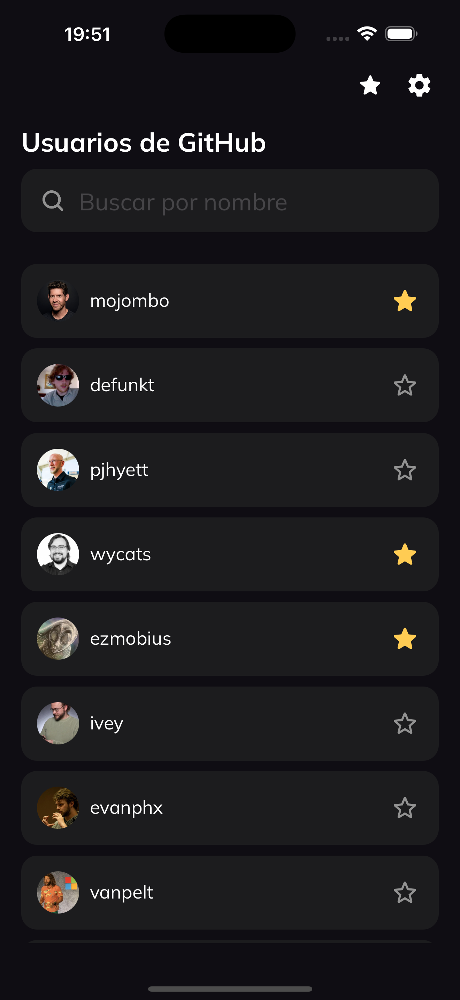
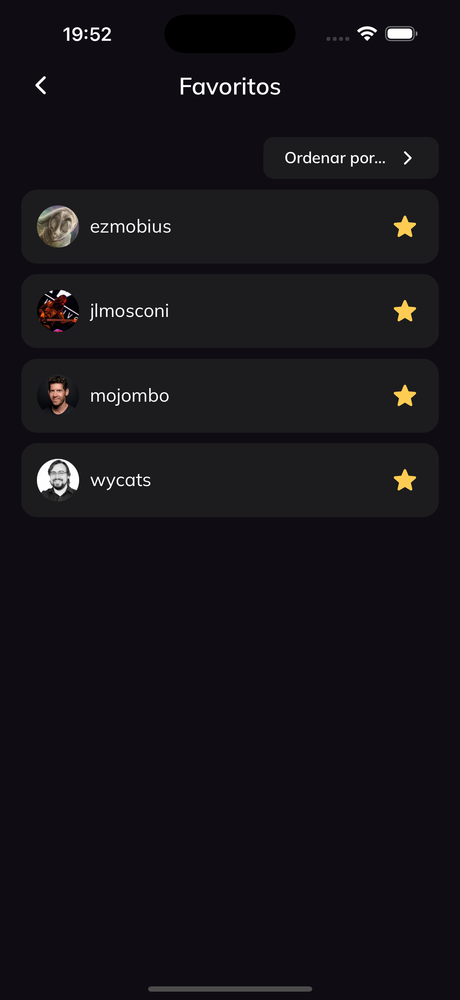

# 📱 Github users list App

Aplicación móvil para visualizar los usuarios de Github, desarrollada con React Native y TypeScript.

<p align="center">
  
  
  
</p>

---

## ⚙️ Requisitos previos

### Yarn

```bash
npm install --global yarn
```

### Ruby y rbenv (para iOS)

```bash
brew install rbenv
echo 'eval "$(rbenv init -)"' >> ~/.zshrc
rbenv install 3.0.0
rbenv global 3.0.0
```

---

## 🚀 Instalación

```bash
yarn install
cd ios && pod install
```

---

## ▶️ Ejecución

### iOS (development)

```bash
yarn ios
```

### iOS (producción)

```bash
yarn ios:prod
```

### Android (development)

```bash
yarn android
```

### Android (producción)

```bash
yarn android:prod
```

---

## ✅ Versiones Soportadas

- **Android**
  - Mínima: 6
- **iOS**
  - Mínima: 14.7

---

## 🧪 Testing

### Correr todos los tests

```bash
yarn test
```

### Correr test en específico

```bash
yarn test <test>
```

---

## 🎨 Theme

Las dimensiones de los componentes de UI escalan dinámicamente según:

- El tamaño de pantalla del dispositivo
- El sistema operativo (iOS / Android)
- El tipo de dispositivo (smartphone / tablet)

Esto permite que el diseño sea responsivo y se adapte correctamente a pantallas grandes como tablets u otros formatos.

Esta configuración se encuentra en:  
[`app/config/theme/index.ts`](./app/config/theme/index.ts)

---

## 📄 Setup adicional

Consultar el archivo [`setup.md`](./setup.md) para detalles sobre configuraciones específicas.